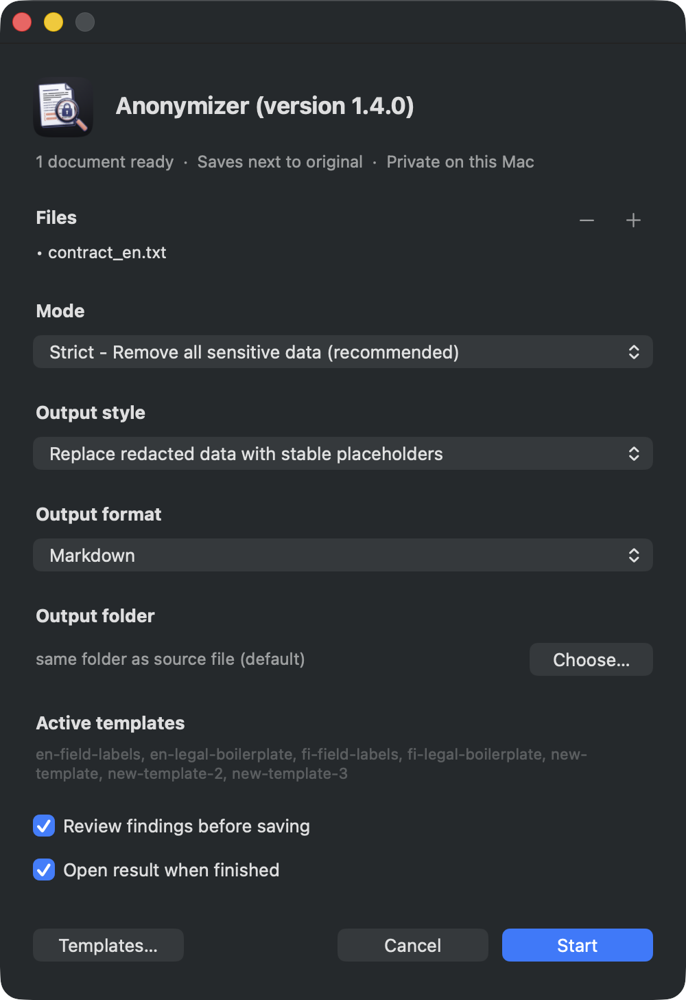
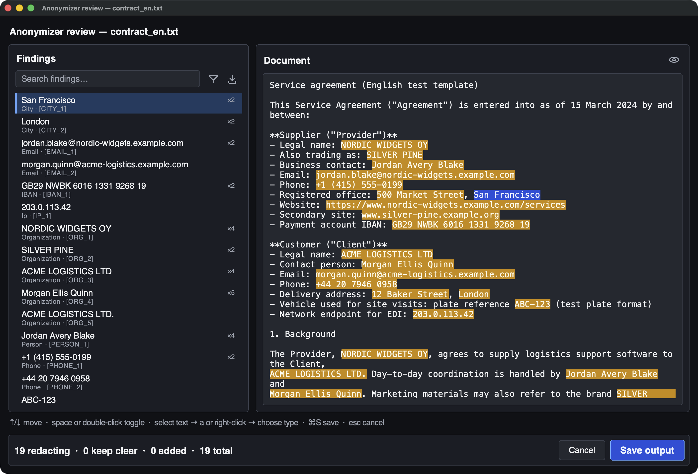

<h1 align="center">
  
  Anonymizer
</h1>

<p align="center">
  <a href="https://github.com/arcane-tl/anonymizer/releases/latest"></a>
  <a href="LICENSE"></a>
  <a href="https://github.com/arcane-tl/anonymizer/releases/latest"></a>
  <a href="https://github.com/arcane-tl/anonymizer/releases/latest"></a>
</p>

Turn contracts, reports, and scans into shareable **Markdown**, **Text PDF**, or **redacted source PDF/DOCX** — on your machine, offline by default.

**Anonymizer** is a local tool for **macOS** and **Windows**: **PDF / DOCX / plain text →** the outputs you tick under **Save as**, with optional PII redaction for **English** and **Finnish**. Personal names, emails, phones, IDs, and more become stable placeholders like `[PERSON_1]` — so you can collaborate, archive, or hand a document to a model without leaking the original identifiers.

- **CLI:** `anonymize`
- **Mac app:** **Anonymizer.app** (drag-and-drop)
- **Windows app:** **Anonymizer** via **Setup.exe** (Start Menu + Apps & features uninstall)
- **Default:** Offline — everything stays on your computer unless you pass `--llm`

> **Not a legal guarantee.** Detection is probabilistic. Native PDF/DOCX output is **hardened best-effort** (text-layer search + wrap/hyphen variants, form/annotation scrub, metadata wipe, residual verification). Image-only text and some embeds can still remain — always spot-check high-stakes output.

---

## Download

| Platform | Recommended | Also |
|----------|-------------|------|
| **macOS** | [Homebrew](#macos--homebrew-recommended) · `brew install --cask anonymizer-app` | [Latest release](https://github.com/arcane-tl/anonymizer/releases/latest) — `Anonymizer-VERSION.zip` |
| **Windows** | [Latest release](https://github.com/arcane-tl/anonymizer/releases/latest) — **`Anonymizer-Setup-VERSION.exe`** | Portable `Anonymizer-VERSION-windows.zip` (keep `runtime\` next to the exe) |
| **CLI only** | macOS: `brew install anonymizer` | Windows: enable “Add CLI to PATH” in Setup, or use the portable `bin\anonymize.cmd` |

On the release page look for:

| Asset | Platform |
|-------|----------|
| `Anonymizer-VERSION.zip` | macOS app (also used by Homebrew cask) |
| `Anonymizer-Setup-VERSION.exe` | Windows installer (Apps & features) |
| `Anonymizer-VERSION-windows.zip` | Windows portable |

Release assets (from **1.2.0** onward): Mac zip, Windows Setup.exe, and Windows portable zip on the same [Releases](https://github.com/arcane-tl/anonymizer/releases/latest) page. Older tags may be Mac-only.

---

## Screenshots

Main window (Mac app) — add files, choose mode/format, templates, and review:

<p align="center">
  
</p>

Document review — toggle findings, inspect the document, then save:

<p align="center">
  
</p>

---

## Supported file types

Anonymizer accepts these **local** inputs:

| Type | Extensions |
|------|------------|
| PDF | `.pdf` (text layer or OCR) |
| Word | `.docx` |
| Plain text / Markdown | `.txt`, `.text`, `.md`, `.markdown` |

**Not supported as direct input** (convert first):

- **Google Docs** — in the browser: **File → Download → Microsoft Word (.docx)** or **PDF Document**. A local `.gdoc` file is only a shortcut, not the document body.
- **Apple Pages** (`.pages`) — in Pages: **File → Export To → Word** or **PDF**.
- Legacy `.doc` / other office formats — save or export as `.docx` or PDF.

If you drop an unsupported type, the CLI and desktop apps show this guidance and link back here.

---

## Use cases

Each scenario below works from the **desktop app** (Mac / Windows) or the **`anonymize` CLI**. Outputs land next to the source by default, or in a folder you choose (**Output folder** / `--out-dir`).

### 1. Batch convert files to Markdown

Turn a pile of PDFs, Word docs, or text into `.md` for search, git, or downstream tools.

**GUI**

1. Drop a folder (or add many files with **+**).
2. Mode: **Extract** (no redaction) or **Strict** / **Standard** if you also want PII scrubbed.
3. **Save as:** tick **Markdown** only.
4. Optional: set **Output folder**, then **Start**.

**CLI**

```bash
# Text only (no redaction) → *.md
anonymize extract ./inbox/ --out-dir ./md-out/

# Redacted Markdown in one pass
anonymize ./inbox/ --format md --out-dir ./md-out/
```

### 2. Batch convert to Text PDF

Produce a reflowed PDF of the (optionally anonymized) text — works for **any** input type, including `.txt`. This is **not** the same as native black-box PDF redaction.

**GUI**

1. Add files or a folder.
2. Mode: **Extract** or a redact mode.
3. **Save as:** tick **PDF text** (and Markdown too if you want both).
4. **Start** → `{stem}.anonymized.text.pdf` (or extract naming for extract mode’s Markdown companion if also ticked).

**CLI**

```bash
anonymize ./inbox/ --format pdf --out-dir ./pdf-out/
anonymize notes.txt --format pdf          # plain text → Text PDF
anonymize extract ./scans/ --format md,pdf --out-dir ./out/
```

### 3. Remove sensitive information from many files in one run

Scrub people, contacts, and (in strict mode) orgs across a batch.

**GUI**

1. Drop the folder or multi-select files.
2. Mode: **Strict** (full scrub) or **Standard** (identity PII; keeps company names).
3. **Save as:** Markdown and/or PDF text; add **Source filetype** for native PDF/DOCX.
4. Leave **Review** on for the first batch until you trust the results; turn off later for speed.
5. **Start**.

**CLI**

```bash
anonymize ./contracts/ --format md,pdf --out-dir ./safe/
anonymize standard ./hr-forms/ --format md --out-dir ./safe/
anonymize ./contracts/ --format md,source,pdf --out-dir ./safe/
```

### 4. Organization-, service-, or document-type templates

Builtin packs only cover field labels and legal *boilerplate*. For client names, product codes, or recurring false positives, use **your** templates.

**GUI**

1. **Templates…** → enable packs for this run; duplicate a builtin or create a user pack.
2. Edit allow / deny lists (names to *keep* vs *always redact*).
3. Run with **Review** on → in the review window, teach keep-clear / new redactions into a user pack.
4. Later runs: same templates stay selected (`templates_enabled` in config).

**CLI**

```bash
anonymize templates                                    # list packs
anonymize contract.pdf --template fi-field-labels,acme-hr
anonymize contract.pdf --review-window --learn-to acme-hr
# After review, keep-clear / user-adds merge into the acme-hr user pack
```

### 5. Fully local review and redaction changes

Nothing leaves the machine by default. Review is transparent: see every tag, un-check false positives, add misses, then write.

**GUI**

1. Add file(s). Mode + **Save as** as needed.
2. Keep **Review findings before saving** checked (default).
3. **Start** → document review window: toggle findings, add spans, optionally **teach** a template.
4. Save; optionally **Open result when finished**.

**CLI**

```bash
anonymize contract.pdf --review-window --format md
anonymize contract.pdf --review                 # terminal checklist
anonymize contract.pdf --reject ORG_1,PHONE_2   # non-interactive keep-clear
```

### 6. Shareable native PDF or Word (layout preserved)

Black-box redaction of the **original** PDF/DOCX (not a reflow). Pair with **More options** for letterhead logos and a hard fail if text-layer hits are missed.

**GUI**

1. Add `.pdf` / `.docx` files.
2. Mode: **Strict** or **Standard**.
3. **Save as:** tick **Source filetype** (optionally Markdown / PDF text too).
4. **More options:** enable **Black-box PDF letterhead/logo images** and/or **Fail if native … misses cleartext**.
5. **Review** recommended, then **Start**.

**CLI**

```bash
anonymize contract.pdf --format source --redact-letterhead-images
anonymize contract.pdf --format md,source --fail-on-native-miss
anonymize brief.docx --format source --redact-style placeholder
```

Plain text with **Source filetype** / `--format source` writes Markdown (`.anonymized.md`) — there is no native `.txt` writer.

### 7. Extract text only (no redaction)

OCR’d archives, bulk text dump, or “just give me Markdown/PDF of what’s in the file.”

**GUI**

1. Mode: **Extract**.
2. **Save as:** Markdown and/or PDF text.
3. **Start** (Review is off in extract).

**CLI**

```bash
anonymize extract ./scans/ --out-dir ./text/
anonymize extract report.pdf --format md,pdf --force-ocr
```

### 8. Hand a document to an LLM without leaking PII

Scrub first, then paste or upload the anonymized Markdown (or Text PDF). Stay offline unless you explicitly pass `--llm`.

**GUI**

1. Mode: **Strict**.
2. **Save as:** Markdown (and PDF text if useful).
3. **Review** on → clear any over-redaction → save.
4. Use the `.anonymized.md` with your model. Do **not** share a `--map` file (it contains PII).

**CLI**

```bash
anonymize notes.pdf --format md --out-dir ./for-llm/
# Optional local LLM *assist* during detection (still writes local files only):
anonymize notes.pdf --format md --llm --llm-provider ollama
```

### 9. Mixed outputs in one pass

One analysis, several artifacts: Markdown for editing, native PDF for layout, Text PDF for a clean reflow.

**GUI**

1. **Save as:** tick **Markdown**, **Source filetype**, and **PDF text**.
2. **Start** → e.g. `contract.anonymized.md`, `contract.anonymized.pdf`, `contract.anonymized.text.pdf`.

**CLI**

```bash
anonymize contract.pdf --format md,source,pdf --out-dir ./out/
# Compat alias:
anonymize contract.pdf --format all --out-dir ./out/
```

---

## Why Anonymizer

- **Privacy first** — processing is local; nothing is sent over the network unless you explicitly enable a remote LLM (`--llm`)  
- **Real office formats** — PDF (including OCR for scans), Word (`.docx`), and text/Markdown  
- **Flexible outputs** — **Save as** any combo: Markdown, Source filetype (black-box PDF / redacted DOCX; plain text → MD), PDF text (`--format md,source,pdf`)  
- **Modes that match the job** — full scrub, identity-only, or plain text extract  
- **Stable placeholders** — the same person stays `[PERSON_1]` throughout a document  
- **English + Finnish** — auto language detection, patterns + neural NER + domain false-positive filters  
- **Human in the loop** — **Review** stays on the main panel; keep false positives in clear text  
- **Templates you own** — org / service / doc-type allow/deny packs; teach after review  
- **More options** when you need them — output style, fail-on-native-miss, letterhead wipe  
- **No hard-coded company catalogs** — patterns, models, and *your* lists only  
- **Desktop GUIs** — same product on Mac (droplet) and Windows (Setup / Start Menu)

---

## Before → after

Synthetic example only:

**Before**

```text
Service Agreement between Nordic Widgets Oy and Acme Logistics Ltd.
Contact: Maija Korhonen <maija.korhonen@nordic-widgets.example.fi>, +358 50 987 6543.
```

**After** (`anonymize` · strict mode)

```text
Service Agreement between [ORG_1] and [ORG_2].
Contact: [PERSON_1] <[EMAIL_1]>, [PHONE_1].
```

Same entity → same tag within that run. Export an optional map file if you need the reverse lookup later (treat it like the original document — it contains PII).

---

## Install

### macOS — Homebrew (recommended)

One product: **Anonymizer**. Terminal: **`anonymize`**. Finder: **Anonymizer.app**.

```bash
brew tap arcane-tl/anonymizer
brew trust arcane-tl/anonymizer    # Homebrew 6+ — once per machine
brew install --cask anonymizer-app # Anonymizer.app + CLI (recommended)
# CLI only: brew install anonymizer

anonymize doctor
anonymize --version
```

**Upgrade** (formula `anonymizer` + cask `anonymizer-app`):

```bash
brew update && brew upgrade anonymizer anonymizer-app
```

If you previously installed the old cask token `anonymizer` (same name as the formula), remove it so the CLI can link:

```bash
brew uninstall --cask --force anonymizer
# if that still errors:
rm -rf "$(brew --prefix)/Caskroom/anonymizer"
rm -rf /Applications/Anonymizer.app

brew install --cask anonymizer-app
brew link --overwrite anonymizer && hash -r
```

More detail: [packaging/homebrew/README.md](packaging/homebrew/README.md).

### Windows — Setup.exe (recommended)

Download **`Anonymizer-Setup-*.exe`** from [Releases](https://github.com/arcane-tl/anonymizer/releases).

```text
Double-click Setup → Next → Finish
  → Start Menu: Anonymizer
  → Settings → Apps: Anonymizer (uninstall here)
  → optional: CLI on PATH as anonymize
```

- Install location: `%LOCALAPPDATA%\Anonymizer` (per-user, no admin)
- No separate system Python required for the Setup build
- Unsigned builds may show SmartScreen → *More info* → *Run anyway*

**Dev / from source (PowerShell):** does **not** register in Apps & features (use Setup for that):

```powershell
git clone https://github.com/arcane-tl/anonymizer.git
cd anonymizer
.\scripts\install.ps1 -Yes -FromSource
anonymize doctor
anonymize-gui
```

Uninstall PowerShell install: `.\scripts\uninstall.ps1 -Yes`  
Full packaging notes: [packaging/windows/README.md](packaging/windows/README.md).

### Other options

| Platform | How |
|----------|-----|
| **macOS** (no Homebrew) | `curl -fsSL https://raw.githubusercontent.com/arcane-tl/anonymizer/main/scripts/install.sh \| bash -s -- --yes` then optional `./packaging/macos/install-app.sh` |
| **Windows portable** | `Anonymizer-*-windows.zip` from Releases — keep `runtime\` next to `Anonymizer.exe` |
| **From source** | Python 3.11+, `pip install -e ".[dev]"`, then spaCy **lg** EN+FI models (default; see [docs/models.md](docs/models.md) for sm/md/sv) |

---

## 60-second tour

```bash
# Health check (models, PATH, optional OCR)
anonymize doctor

# Full scrub (default) → contract.anonymized.md
anonymize contract.pdf

# Identity only — keep company names, scrub people & contact details
anonymize standard sopimus.pdf

# Text only — no redaction
anonymize extract report.pdf

# Review redactions before writing (terminal checklist)
anonymize contract.pdf --review
# ↑/↓ move · space check · enter confirm
# Document window (same as desktop GUIs): anonymize contract.pdf --review-window
# Or non-interactive: anonymize contract.pdf --reject ORG_1,PHONE_2

# Delete findings instead of [PERSON_1] tags
anonymize contract.pdf --redact-style remove

# Markdown + redacted source (PDF→PDF / DOCX→DOCX)
anonymize contract.pdf --format md,source
# Source only (native black-box PDF, no Markdown file): --format source

# Reflowed text PDF from Markdown (any input; distinct from source black-box)
anonymize notes.txt --format pdf
anonymize contract.pdf --format md,source,pdf
# → contract.anonymized.md + contract.anonymized.pdf + contract.anonymized.text.pdf

anonymize examples    # more copy-paste commands
anonymize --help
```

**Desktop GUI** (same product logic on Mac and Windows)

| | |
|--|--|
| **Mac** | **Anonymizer.app** (Applications / Homebrew cask). Double-click opens options with an empty file list, or drop files to pre-fill. Needs CLI on PATH for the droplet. |
| **Windows** | Start Menu **Anonymizer** (after Setup.exe), or portable `Anonymizer.exe`. |

**Options panel map**

| Control | Role |
|---------|------|
| **Files** (+ / −) | Add from several folders; drop or argv pre-fills |
| **Mode** | Strict / Standard / Extract |
| **Save as** | Tick **Markdown**, **Source filetype**, **PDF text** (any combo) |
| **Output folder** | Default: same folder as source; or Choose… (`--out-dir`) |
| **Active templates** / **Templates…** | Allow/deny packs for this run |
| **Review findings** | Always visible (default on) → document review window |
| **Open result when finished** | Always visible |
| **More options** | Collapsed: output style, fail-on-native-miss, letterhead wipe |

See [Use cases](#use-cases) for step-by-step scenarios.

---

## Modes

| Mode | Command | What it does | Default output |
|------|---------|--------------|----------------|
| **strict** | `anonymize FILE` | Full scrub — people, companies, addresses, geo, URLs, plates, IDs, … | `FILE.anonymized.md` |
| **standard** | `anonymize standard FILE` | Identity PII — person, email, phone, hetu, addresses, IBAN, cards, IP. **Keeps** companies, Y-tunnus, VAT, URLs, plates | `FILE.anonymized.md` |
| **extract** | `anonymize extract FILE` | Markdown only — **no redaction** | `FILE.md` |

Aliases: `text` → extract · `normal` / `pii` → standard · `scrub` / `full` → strict.

---

## Privacy & security

| Mode | Document text leaves this machine? |
|------|-------------------------------------|
| Default (`anonymize file.pdf`) | **No** — local extract, spaCy, patterns only |
| `--llm` + ollama on localhost | **No** |
| `--llm` + non-local `ollama_url` | **Yes** — warned; blocked by `--offline` |
| `--llm --llm-provider xai` | **Yes** — sent to `https://api.x.ai` (`XAI_API_KEY`) |
| Config `use_llm: true` **without** `--llm` | **No** — CLI requires explicit `--llm` |
| `--offline` | Blocks remote xAI and non-loopback Ollama |

- **No telemetry** in this application  
- **`--map`** writes placeholder → original JSON (**contains PII**; mode `0600` when possible)  
- Install-time network: Homebrew / Setup download / spaCy models / optional LLM  
- **Native PDF/DOCX** is hardened best-effort (variants + form/annot scrub + residual verify), not a forensic wipe

---

## What gets redacted (strict)

| Kind | Placeholder |
|------|-------------|
| Person | `[PERSON_n]` |
| Organization / brand | `[ORG_n]` |
| Email / phone | `[EMAIL_n]` / `[PHONE_n]` |
| Street, city, FI postcode | `[STREET_n]` / `[CITY_n]` / `[POSTAL_n]` |
| URL | `[URL_n]` |
| FI plate / hetu / Y-tunnus / VAT | `[PLATE_FI_n]` / `[FI_HETU_n]` / … |
| IBAN, card, IP, VIN (strict) | `[IBAN_n]`, … |

Dates are off by default (`--include-dates` to enable).  
`--entities …` overrides the mode preset. YAML config: [config.example.yaml](config.example.yaml).

### How detection works (short)

Patterns (IDs, emails, legal-form companies) + heuristics + **spaCy NER** (EN/FI, optional **SV**) + domain false-positive filters (contract roles, legal collocations, form labels) + optional **LLM** proposals + **templates** (named allow/deny packs). The app does **not** ship a list of real-world companies or people — builtin templates are field labels and legal *boilerplate* only. Create user packs for client-specific names; teach them after `--review` with `--learn-to`. See `config.example.yaml` and `anonymize templates`. Add domain IDs via YAML **custom recognizers** (`recognizers:`) — see [docs/plugins.md](docs/plugins.md).

---

## Useful options

```bash
anonymize report.pdf -o clean.md          # explicit output
anonymize ./inbox/ --out-dir ./out/       # batch folder
anonymize scan.pdf --force-ocr            # scanned PDF
anonymize doc.pdf --lang fi               # force Finnish NLP
anonymize doc.pdf --map report.map.json   # sensitive reverse map
anonymize doc.pdf --config config.yaml    # mode, templates, …
anonymize templates                       # list allow/deny packs
anonymize doc.pdf --template fi-field-labels,my-company
anonymize doc.pdf --review --learn-to my-company
anonymize doc.pdf --llm --llm-provider ollama   # optional local LLM layer
```

| Flag | GUI counterpart | Role |
|------|-----------------|------|
| `-r` / `--review` | **Review findings** (terminal) | Checklist: mark false positives to keep clear before write |
| `--review-window` | **Review findings** (default) | Document review UI (Mac/Windows GUIs) |
| `--reject LIST` | — | Same without a prompt (`ORG_1,PHONE_2`) |
| `--redact-style` | **More options → Output style** | `placeholder` (default) or `remove`. Review works with both. |
| `--format` | **Save as** ticks | `md` / `source` / `pdf` (comma list). Source on plain text → Markdown. Compat: `both`=`md,source`, `all`=`md,source,pdf`. |
| `--fail-on-native-miss` | **More options** | Exit 1 if native PDF/DOCX misses or residuals remain |
| `--redact-letterhead-images` | **More options** | Black-box PDF header/footer logo bands |
| `--llm` | — | Opt-in LLM layer (`--offline` blocks remote xAI / non-local Ollama) |
| `--keep-headers` | — | Keep PDF running headers/footers (default: strip) |
| `-o -` | — | Markdown on stdout (progress on stderr) |
| `--out-dir` | **Output folder** | Batch / chosen directory |
| `--config` | — | YAML: mode, `templates_enabled`, `format`, … |
| `--template` | **Templates…** | Comma-separated pack ids |
| `--learn-to` | Review window → teach | Merge keep-clear / user-adds into a user template |

**GUIs (Mac + Windows):** empty file list or drop/argv pre-fill; **Save as** / **Review** / **Open** / **More options** as above; **Templates…** (Mac: AppKit + `templates_io`; Windows: Tk). Teach packs from the **review window**. Selection persists as `templates_enabled` in `~/.config/anonymizer/config.yaml`.

---

## Troubleshooting

| Message / issue | Fix |
|-----------------|-----|
| No Cask with this name | `brew tap arcane-tl/anonymizer` |
| Untrusted tap (Homebrew 6+) | `brew trust arcane-tl/anonymizer` (note the final **r**) |
| “Anonymizer is damaged…” | `brew reinstall --cask anonymizer-app` |
| `anonymize: command not found` / `skipping link` | Uninstall old cask token: `brew uninstall --cask anonymizer`; then `brew install --cask anonymizer-app`; `brew link --overwrite anonymizer && hash -r` |
| Windows: not in Apps & features | Install with **Setup.exe**, not only `install.ps1` |
| Windows: GUI won’t open | Run `anonymize-gui` in a console; check `%TEMP%\anonymizer-gui.log`; see [packaging/windows/README.md](packaging/windows/README.md) |
| Windows: uninstall after `install.ps1` | `.\scripts\uninstall.ps1 -Yes` (not appwiz) |

---

## Development

```bash
python3 -m venv .venv && source .venv/bin/activate
pip install -e ".[dev]"
python -m spacy download en_core_web_lg   # default quality (also fi_core_news_lg)
python -m spacy download fi_core_news_lg
pytest -q
```

spaCy models (switch size, add Swedish): **[docs/models.md](docs/models.md)**.

Regression: `tests/test_contract_templates.py`, `tests/test_realworld_precision.py`, `tests/test_offline_security.py`.  
See [tests/fixtures/README.md](tests/fixtures/README.md).

Packaging:

- Mac GUI: [packaging/macos/README.md](packaging/macos/README.md)
- Windows Setup / GUI: [packaging/windows/README.md](packaging/windows/README.md)
- Homebrew: [packaging/homebrew/README.md](packaging/homebrew/README.md)

---

## Support this project

If Anonymizer is useful to you, you can support its development via GitHub Sponsors:

**[Sponsor @arcane-tl on GitHub](https://github.com/sponsors/arcane-tl)**

---

## License

MIT — see [LICENSE](LICENSE).
