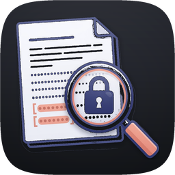

<h1 align="center">
  
  Anonymizer
</h1>

<p align="center">
  <a href="https://github.com/arcane-tl/anonymizer/releases/latest"></a>
  <a href="LICENSE"></a>
  <a href="https://github.com/arcane-tl/anonymizer/releases/latest"></a>
  <a href="https://github.com/arcane-tl/anonymizer/releases/latest"></a>
</p>

Turn contracts, reports, and scans into shareable Markdown — on your machine, offline by default.

**Anonymizer** is a local tool for **macOS** and **Windows**: **PDF / DOCX / plain text → Markdown or source filetype**, with optional PII redaction for **English** and **Finnish**. Personal names, emails, phones, IDs, and more become stable placeholders like `[PERSON_1]` — so you can collaborate, archive, or hand a document to a model without leaking the original identifiers.

- **CLI:** `anonymize`
- **Mac app:** **Anonymizer.app** (drag-and-drop)
- **Windows app:** **Anonymizer** via **Setup.exe** (Start Menu + Apps & features uninstall)
- **Default:** Offline — everything stays on your computer unless you pass `--llm`

> **Not a legal guarantee.** Detection is probabilistic. Native PDF/DOCX output is **best-effort** (text-layer search; images/forms/comments may remain). Always spot-check high-stakes output.

---

## Download

| Platform | Recommended | Also |
|----------|-------------|------|
| **macOS** | [Homebrew](#macos--homebrew-recommended) · `brew install --cask anonymizer-app` | [Latest release](https://github.com/arcane-tl/anonymizer/releases/latest) — `Anonymizer-VERSION.zip` |
| **Windows** | [Latest release](https://github.com/arcane-tl/anonymizer/releases/latest) — **`Anonymizer-Setup-VERSION.exe`** | Portable `Anonymizer-VERSION-windows.zip` (keep `runtime\` next to the exe) |
| **CLI only** | macOS: `brew install anonymizer` | Windows: enable “Add CLI to PATH” in Setup, or use the portable `bin\anonymize.cmd` |

On the release page look for:

| Asset | Platform |
|-------|----------|
| `Anonymizer-VERSION.zip` | macOS app (also used by Homebrew cask) |
| `Anonymizer-Setup-VERSION.exe` | Windows installer (Apps & features) |
| `Anonymizer-VERSION-windows.zip` | Windows portable |

Release assets (from **1.2.0** onward): Mac zip, Windows Setup.exe, and Windows portable zip on the same [Releases](https://github.com/arcane-tl/anonymizer/releases/latest) page. Older tags may be Mac-only.

---

## Why Anonymizer

- **Privacy first** — processing is local; nothing is sent over the network unless you explicitly enable a remote LLM (`--llm`)  
- **Real office formats** — PDF (including OCR for scans), Word (`.docx`), and text/Markdown  
- **Optional source redaction** — redacted `.pdf` / `.docx` matching the input type (`--format source` or `both`)  
- **Modes that match the job** — full scrub, identity-only, or plain text extract  
- **Stable placeholders** — the same person stays `[PERSON_1]` throughout a document  
- **English + Finnish** — auto language detection, patterns + neural NER + domain false-positive filters  
- **Human in the loop** — optional review to keep false positives in clear text  
- **No hard-coded company catalogs** — patterns, models, and *your* allow/deny lists only  
- **Desktop GUIs** — same options on Mac (droplet) and Windows (Setup wizard / Start Menu)

---

## Before → after

Synthetic example only:

**Before**

```text
Service Agreement between Nordic Widgets Oy and Acme Logistics Ltd.
Contact: Maija Korhonen <maija.korhonen@nordic-widgets.example.fi>, +358 50 987 6543.
```

**After** (`anonymize` · strict mode)

```text
Service Agreement between [ORG_1] and [ORG_2].
Contact: [PERSON_1] <[EMAIL_1]>, [PHONE_1].
```

Same entity → same tag within that run. Export an optional map file if you need the reverse lookup later (treat it like the original document — it contains PII).

---

## Install

### macOS — Homebrew (recommended)

One product: **Anonymizer**. Terminal: **`anonymize`**. Finder: **Anonymizer.app**.

```bash
brew tap arcane-tl/anonymizer
brew trust arcane-tl/anonymizer    # Homebrew 6+ — once per machine
brew install --cask anonymizer-app # Anonymizer.app + CLI (recommended)
# CLI only: brew install anonymizer

anonymize doctor
anonymize --version
```

**Upgrade** (formula `anonymizer` + cask `anonymizer-app`):

```bash
brew update && brew upgrade anonymizer anonymizer-app
```

If you previously installed the old cask token `anonymizer` (same name as the formula), remove it so the CLI can link:

```bash
brew uninstall --cask --force anonymizer
# if that still errors:
rm -rf "$(brew --prefix)/Caskroom/anonymizer"
rm -rf /Applications/Anonymizer.app

brew install --cask anonymizer-app
brew link --overwrite anonymizer && hash -r
```

More detail: [packaging/homebrew/README.md](packaging/homebrew/README.md).

### Windows — Setup.exe (recommended)

Download **`Anonymizer-Setup-*.exe`** from [Releases](https://github.com/arcane-tl/anonymizer/releases).

```text
Double-click Setup → Next → Finish
  → Start Menu: Anonymizer
  → Settings → Apps: Anonymizer (uninstall here)
  → optional: CLI on PATH as anonymize
```

- Install location: `%LOCALAPPDATA%\Anonymizer` (per-user, no admin)
- No separate system Python required for the Setup build
- Unsigned builds may show SmartScreen → *More info* → *Run anyway*

**Dev / from source (PowerShell):** does **not** register in Apps & features (use Setup for that):

```powershell
git clone https://github.com/arcane-tl/anonymizer.git
cd anonymizer
.\scripts\install.ps1 -Yes -FromSource
anonymize doctor
anonymize-gui
```

Uninstall PowerShell install: `.\scripts\uninstall.ps1 -Yes`  
Full packaging notes: [packaging/windows/README.md](packaging/windows/README.md).

### Other options

| Platform | How |
|----------|-----|
| **macOS** (no Homebrew) | `curl -fsSL https://raw.githubusercontent.com/arcane-tl/anonymizer/main/scripts/install.sh \| bash -s -- --yes` then optional `./packaging/macos/install-app.sh` |
| **Windows portable** | `Anonymizer-*-windows.zip` from Releases — keep `runtime\` next to `Anonymizer.exe` |
| **From source** | Python 3.11+, `pip install -e ".[dev]"`, then spaCy **lg** EN+FI models (default; see [docs/models.md](docs/models.md) for sm/md/sv) |

---

## 60-second tour

```bash
# Health check (models, PATH, optional OCR)
anonymize doctor

# Full scrub (default) → contract.anonymized.md
anonymize contract.pdf

# Identity only — keep company names, scrub people & contact details
anonymize standard sopimus.pdf

# Text only — no redaction
anonymize extract report.pdf

# Review redactions before writing (terminal checklist)
anonymize contract.pdf --review
# ↑/↓ move · space check · enter confirm
# Document window (same as desktop GUIs): anonymize contract.pdf --review-window
# Or non-interactive: anonymize contract.pdf --reject ORG_1,PHONE_2

# Delete findings instead of [PERSON_1] tags
anonymize contract.pdf --redact-style remove

# Both: Markdown + redacted source (PDF→PDF, DOCX→DOCX)
anonymize contract.pdf --format both
# Source only (no Markdown): --format source

anonymize examples    # more copy-paste commands
anonymize --help
```

**Desktop GUI**

| | |
|--|--|
| **Mac** | Open **Anonymizer** from Applications / `~/Applications`, drop files (or pick files). Needs CLI on PATH for the droplet. |
| **Windows** | Start Menu **Anonymizer** (after Setup.exe). Choose documents → same options as Mac. |

GUI options: mode / output style / output format pop-ups, **Review findings before saving** (default on), open when finished, **Lists…**.

---

## Modes

| Mode | Command | What it does | Default output |
|------|---------|--------------|----------------|
| **strict** | `anonymize FILE` | Full scrub — people, companies, addresses, geo, URLs, plates, IDs, … | `FILE.anonymized.md` |
| **standard** | `anonymize standard FILE` | Identity PII — person, email, phone, hetu, addresses, IBAN, cards, IP. **Keeps** companies, Y-tunnus, VAT, URLs, plates | `FILE.anonymized.md` |
| **extract** | `anonymize extract FILE` | Markdown only — **no redaction** | `FILE.md` |

Aliases: `text` → extract · `normal` / `pii` → standard · `scrub` / `full` → strict.

---

## Privacy & security

| Mode | Document text leaves this machine? |
|------|-------------------------------------|
| Default (`anonymize file.pdf`) | **No** — local extract, spaCy, patterns only |
| `--llm` + ollama on localhost | **No** |
| `--llm` + non-local `ollama_url` | **Yes** — warned; blocked by `--offline` |
| `--llm --llm-provider xai` | **Yes** — sent to `https://api.x.ai` (`XAI_API_KEY`) |
| Config `use_llm: true` **without** `--llm` | **No** — CLI requires explicit `--llm` |
| `--offline` | Blocks remote xAI and non-loopback Ollama |

- **No telemetry** in this application  
- **`--map`** writes placeholder → original JSON (**contains PII**; mode `0600` when possible)  
- Install-time network: Homebrew / Setup download / spaCy models / optional LLM  
- **Native PDF/DOCX** is best-effort layout redaction, not a forensic wipe

---

## What gets redacted (strict)

| Kind | Placeholder |
|------|-------------|
| Person | `[PERSON_n]` |
| Organization / brand | `[ORG_n]` |
| Email / phone | `[EMAIL_n]` / `[PHONE_n]` |
| Street, city, FI postcode | `[STREET_n]` / `[CITY_n]` / `[POSTAL_n]` |
| URL | `[URL_n]` |
| FI plate / hetu / Y-tunnus / VAT | `[PLATE_FI_n]` / `[FI_HETU_n]` / … |
| IBAN, card, IP, VIN (strict) | `[IBAN_n]`, … |

Dates are off by default (`--include-dates` to enable).  
`--entities …` overrides the mode preset. YAML config: [config.example.yaml](config.example.yaml).

### How detection works (short)

Patterns (IDs, emails, legal-form companies) + heuristics + **spaCy NER** (EN/FI, optional **SV**) + domain false-positive filters (contract roles, legal collocations, form labels) + optional **LLM** proposals + **templates** (named allow/deny packs). The app does **not** ship a list of real-world companies or people — builtin templates are field labels and legal *boilerplate* only. Create user packs for client-specific names; teach them after `--review` with `--learn-to`. See `config.example.yaml` and `anonymize templates`. Add domain IDs via YAML **custom recognizers** (`recognizers:`) — see [docs/plugins.md](docs/plugins.md).

---

## Useful options

```bash
anonymize report.pdf -o clean.md          # explicit output
anonymize ./inbox/ --out-dir ./out/       # batch folder
anonymize scan.pdf --force-ocr            # scanned PDF
anonymize doc.pdf --lang fi               # force Finnish NLP
anonymize doc.pdf --map report.map.json   # sensitive reverse map
anonymize doc.pdf --config config.yaml    # mode, templates, …
anonymize templates                       # list allow/deny packs
anonymize doc.pdf --template fi-field-labels,my-company
anonymize doc.pdf --review --learn-to my-company
anonymize doc.pdf --llm --llm-provider ollama   # optional local LLM layer
```

| Flag | Role |
|------|------|
| `-r` / `--review` | Terminal checklist: mark false positives to keep clear before write |
| `--review-window` | Document review UI (used by Mac/Windows GUIs) |
| `--reject LIST` | Same without a prompt (`ORG_1,PHONE_2`) |
| `--redact-style` | `placeholder` (default tags) or `remove` (delete text). Review works with both. |
| `--format` | `md` (default Markdown only), `source` (redacted original PDF or Word, same type as input), or `both`. PDF = black boxes + metadata scrub; DOCX = tags/delete + property scrub. **Best-effort** (not forensic): images, some forms/comments, wrap misses may remain. Text inputs stay Markdown-only. |
| `--llm` | Opt-in LLM layer only (YAML `use_llm` alone is ignored). `--offline` blocks remote xAI and non-local Ollama URLs. |
| `--keep-headers` | Keep PDF running headers/footers (default: strip) |
| `-o -` | Markdown on stdout (progress stays on stderr) |
| `--config` | YAML: mode, `templates_enabled`, allowlist/denylist (legacy), `redact_style`, `format`, … |
| `--template` | Comma-separated template ids (allow/deny packs). Default: builtin packs marked default. |
| `--learn-to` | After `--review`, merge keep-clear / user-added surfaces into a user template. |

**GUIs (Mac + Windows):** mode / style / format as pop-ups, **Review findings before saving** (default on), open when finished. **Lists…** saves allow/deny to `~/.config/anonymizer/config.yaml` (same on both platforms).

---

## Troubleshooting

| Message / issue | Fix |
|-----------------|-----|
| No Cask with this name | `brew tap arcane-tl/anonymizer` |
| Untrusted tap (Homebrew 6+) | `brew trust arcane-tl/anonymizer` (note the final **r**) |
| “Anonymizer is damaged…” | `brew reinstall --cask anonymizer-app` |
| `anonymize: command not found` / `skipping link` | Uninstall old cask token: `brew uninstall --cask anonymizer`; then `brew install --cask anonymizer-app`; `brew link --overwrite anonymizer && hash -r` |
| Windows: not in Apps & features | Install with **Setup.exe**, not only `install.ps1` |
| Windows: GUI won’t open | Run `anonymize-gui` in a console; check `%TEMP%\anonymizer-gui.log`; see [packaging/windows/README.md](packaging/windows/README.md) |
| Windows: uninstall after `install.ps1` | `.\scripts\uninstall.ps1 -Yes` (not appwiz) |

---

## Development

```bash
python3 -m venv .venv && source .venv/bin/activate
pip install -e ".[dev]"
python -m spacy download en_core_web_lg   # default quality (also fi_core_news_lg)
python -m spacy download fi_core_news_lg
pytest -q
```

spaCy models (switch size, add Swedish): **[docs/models.md](docs/models.md)**.

Regression: `tests/test_contract_templates.py`, `tests/test_realworld_precision.py`, `tests/test_offline_security.py`.  
See [tests/fixtures/README.md](tests/fixtures/README.md).

Packaging:

- Mac GUI: [packaging/macos/README.md](packaging/macos/README.md)
- Windows Setup / GUI: [packaging/windows/README.md](packaging/windows/README.md)
- Homebrew: [packaging/homebrew/README.md](packaging/homebrew/README.md)

---

## Support this project

If Anonymizer is useful to you, you can support its development via GitHub Sponsors:

**[Sponsor @arcane-tl on GitHub](https://github.com/sponsors/arcane-tl)**

---

## License

MIT — see [LICENSE](LICENSE).
